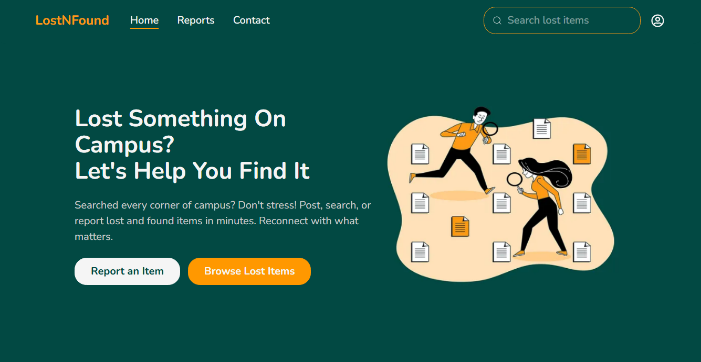
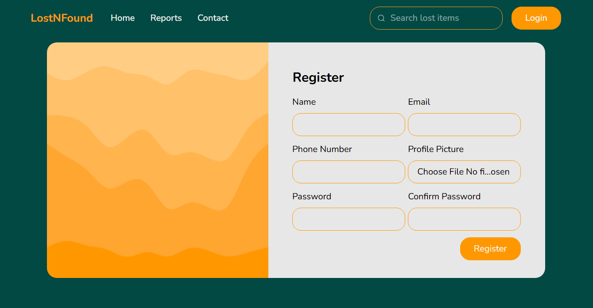
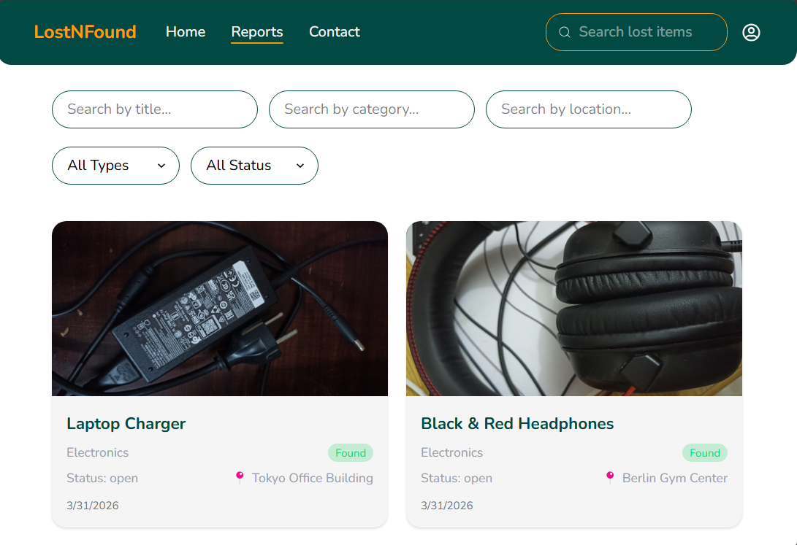
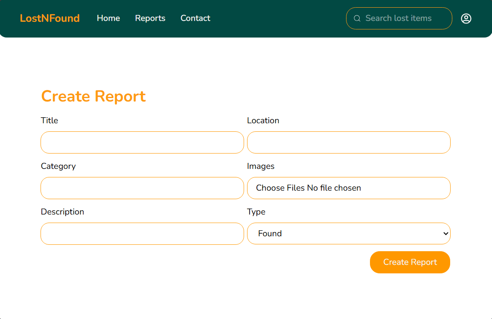
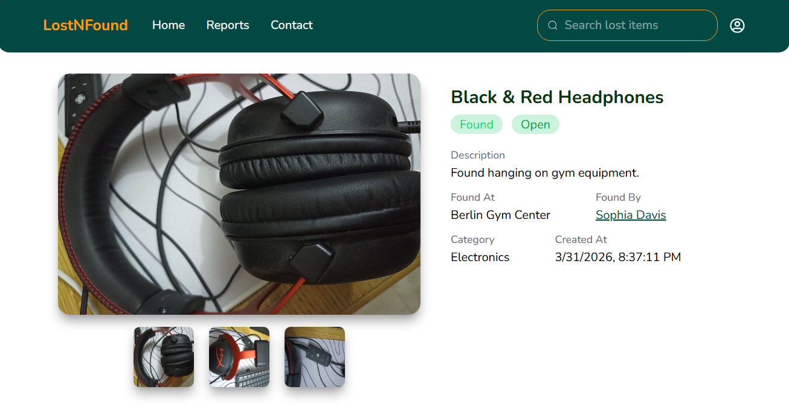

# LostNFound Frontend

## Overview
LostNFound is a full-stack web application designed to streamline the process of reporting, searching, and recovering lost or found items.

This repository contains the frontend implementation built using React, Redux, and Tailwind CSS. It provides a responsive and user-friendly interface while integrating with a secure backend API.

---

## Features

### Authentication
- User registration and login
- Email verification
- Persistent sessions using local storage
- Token refresh mechanism for uninterrupted sessions

### Routing and Access Control
- Public and protected routes
- Unauthorized users are redirected to the login page
- Route protection based on authentication state

### Report Management
- Create lost and found reports
- Update reports (restricted to report owner)
- View reports list
- View detailed report information

### Search and Filtering
- Search by title, category, or location
- Filter by type (Lost / Found)
- Filter by report status (Open / Claimed / Closed)

### Comments and Replies
- Add comments to reports
- Reply to comments (nested structure)
- Dynamic UI updates without page reload

### User Profile
- Display user information
- View reports created by the user

---
## Screenshots
### Home Page


### Login Page


### Reports Page


### Create Report Page


### Report Details


## Tech Stack

- React
- Redux
- React Router DOM
- Tailwind CSS
- Firebase Authentication

---

## Project Structure
  src/
  │── components/
  │── pages/
  │── services/
  │── store/
  │── utils/
  │── App.jsx
  │── main.jsx


---

## Installation and Setup

```bash
git clone https://github.com/mariamayman10/lostNfound-frontend
cd frontend
npm install
npm run dev
```
---
## Environment Variables
Create a .env file in the root directory:
```bash
VITE_BACKEND_URL=your_backend_url
VITE_FIREBASE_API_KEY=your_api_key
VITE_FIREBASE_AUTH_DOMAIN=your_auth_domain
```

## Security and State Management
  - Authentication state is managed using Redux
  - Tokens are stored in local storage
  - Protected routes enforce access control
  - Automatic token refresh ensures session continuity

## Related Repository
Backend: https://github.com/mariamayman10/lostNfound-backend
